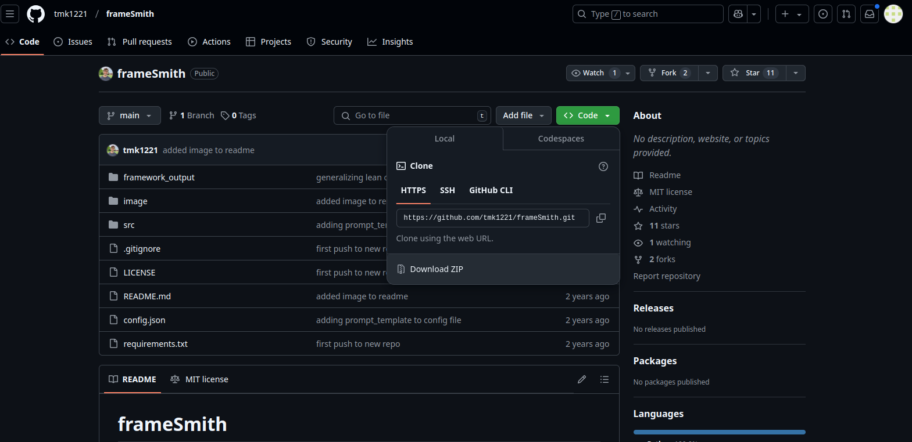
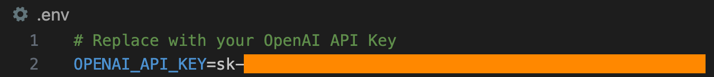

## Steps to run the code 

### 0. open the terminal

### 1. download the repo
```
git clone https://github.com/Aananda-giri/framesmith
cd framesmith
```

or goto github repo and download zip, extract





### 2. virtual environment (optional)
```
pip install virtualenv    # install virtualenv
python3 -m virtualenv venv # initialize new environment


venv\Scripts\activate  # activate environment
```
if above line does not activate the environment, one of these lines should:

```
.\venv\Scripts\Activate
source venv/Scripts/activate
source venv/bin/activate
```

### 3. install requirements
`pip install -r requirements.txt`

### 4. install playwright (one of these command should work)
```
playwright install
python3 -m playwright install
python -m playwright install
```


### 5. Create a file in the root directory called `.env`, and add your OpenAI API key as shown below. No quotes necessary.



### 6. run the flask app
`python3 flask-lean-canvas.py`

### 7. open this url in browser
`http://127.0.0.1:5000`