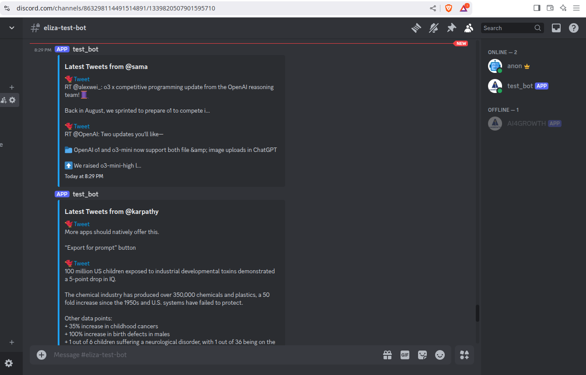

# TWEETS-2-DISCORD

A Node.js application that fetches tweets from specified Twitter users and posts them in a Discord channel at a set interval.

## Features

- Fetches **N** latest tweets from specified Twitter users.
- Posts the tweets (or their summaries using **Atoma**) in a Discord channel.
- Runs at a user-defined interval.
- Stores tweet data in MongoDB.

## Installation

Ensure you have **pnpm** installed. Then, run the following commands to install dependencies:

```sh
# Load environment variables
pnpm install dotenv --save

# Fetch tweets
pnpm install agent-twitter-client --save

# Post tweets to Discord
pnpm install discord.js --save

# Store tweets in MongoDB
pnpm install mongoose --save

# Auto-restart on file changes (development only)
pnpm install nodemon --save-dev
```

## Setup

### 1. Create and Configure a Discord Bot

- create discord-bot at [discord.com/developers](https://discord.com/developers/)
- get bot `APPLICATION Id` (under `General Information` tab & add to `.env` file)
- create bot token (`Create Token` button under `Bot` tab & add to `.env` file)
- bot invite link: (replace with your `APPLICATION Id` in below invite link)
  https://discord.com/api/oauth2/authorize?client_id=<bot-application-id>&permissions=536870911991&scope=bot-

* Ensure the bot has permission to read and send messages in the target channel.
* Copy and save the **channel ID** to `.env` file.

### 2. Configure Environment Variables

Create a `.env` file in the root directory and add the following credentials:

```sh
# Twitter Credentials
TWITTER_USERNAME=your_twitter_username
TWITTER_PASSWORD=your_twitter_password
TWITTER_EMAIL=your_twitter_email

# Twitter Settings
TWITTER_USER_NAMES=sama,karpathy  # Comma-separated list of Twitter usernames to fetch tweets from
N_TWEETS_PER_USER=10              # Max number of tweets per user per 24-hour cycle

# MongoDB Connection
MONGO_URI=mongodb+srv://your_mongo_connection_string

# Atoma API for Summarization
ATOMA_BEARER=your_atoma_api_token

# Discord Bot Credentials
DISCORD_APPLICATION_ID=your_discord_application_id
DISCORD_API_TOKEN=your_discord_bot_token
CHANNEL_ID=your_discord_channel_id
MESSAGE_INTERVAL=60000  # Interval in milliseconds (e.g., 60000 = 60 sec)
```

## Running the Application

To start the bot, simply run:

```sh
pnpm start
```

For development (auto-restart on file changes):

```sh
pnpm run dev
```

## To-Do

- [ ] Summarise tweets using atoma if `SUMMARISE=true` in `.env` file
- [ ] Integrate with eliza and use eliza's sessions for discord-bot login and twitter-agent login
- [ ] Send message to individual users.

## Example Output



---

Happy coding! 🚀
